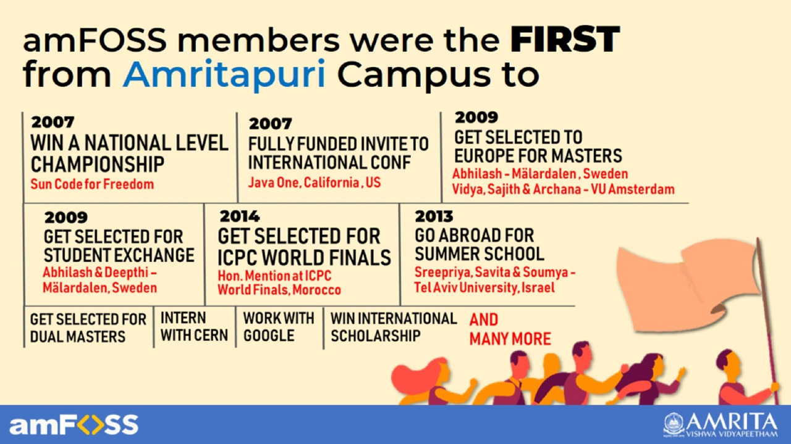

# Praveshan - Join amFOSS

## How to Join FOSS@Amrita

If you are excited about joining FOSS@Amrita, there are multiple ways to gain membership - 

### **I. For Freshers \(S1 & S2\)** 

####     **a.  Fresher's Tasks** 

Interested students are required to attempt to complete a list of given tasks. Evaluation will be done based on these tasks followed by an interview. ****


**Status : Active - You can find the tasks in** [**Live Contests/Fresher Tasks**](https://join.amfoss.in/live-contests/fresher-tasks)\*\*\*\*

Deadline : 11 August, 2019


#### **b.  Fresher's Workshop/Contest**

The Fresher's workshop is a 6 week long program intended to equip anyone with the fundamentals required to further build and develop their interest and expertise. A background in computer science is certainly not required for attending this workshop. Among the participating students, motivated and interested students will be selected for membership interview. For more details on Selection Process, [go here](https://join.amfoss.in/selection/selection-process)


Status : **Registrations are not open yet - Stay Tuned** 


### II. For Others \(S3 and above\) 

####      Long Challenge

Students can participate in the Long Challenge conducted by the club, get selected and join the club. For more details, refer Live Contests/Long Challenge.

####     

