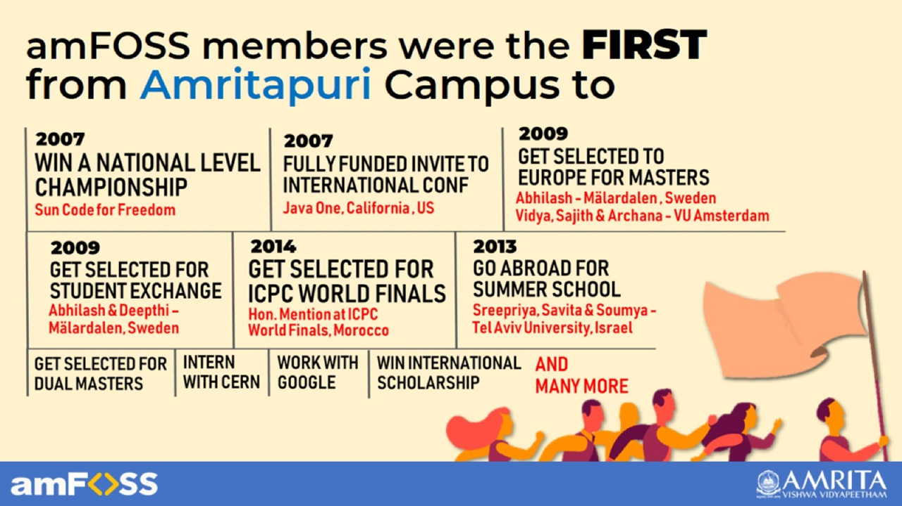

# Praveshan - Join amFOSS

## How to join?

There are multiple ways to gain membership - 


For latest updates, please follow us on [Instagram](https://instagram.com/amfoss.in), [Facebook](https://facebook.com/amfoss.in) and[ Twitter](https://twitter.com/amfoss_in)


## **I. For Freshers \(2020 Batch\)**

### **Fresher's Tasks** 

Interested students are required to attempt to complete a list of given tasks. 


**To get the Fresher's Tasks for 2020, please fill out the form at** [**Live Contests/Freshers Task**](live-contests/freshers-tasks-2020-21.md)\*\*\*\*


## II. For Others \(S4 and above\) 

###      Long Challenge

Students can participate in the Long Challenge to join the club. 


**For more details, refer** [**Live Contests/Long Challenge.**](https://join.amfoss.in/live-contests/long-challenge)\*\*\*\*


